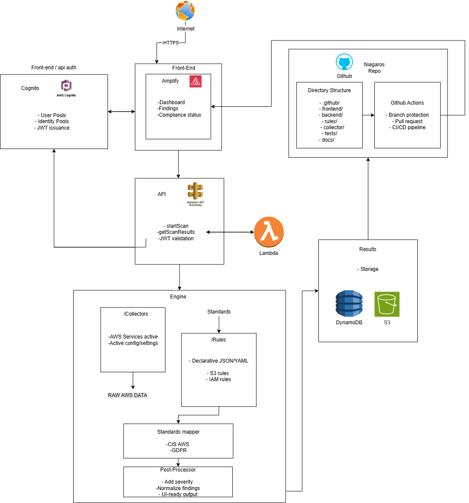

# Niagaros CSPM (Cloud Security Posture Management) – MVP

Niagaros is developing a Cloud Security Posture Management (CSPM) solution to help organizations identify security misconfigurations in their cloud environments.  
This repository contains the initial MVP version of the Niagaros CSPM platform, built specifically for **Domits** as the first pilot customer.

The first iteration focuses exclusively on **AWS** and starts with a single resource type: **Amazon S3**.

---

## Project Overview

Modern cloud environments introduce a wide range of security risks, especially when configurations are inconsistent or not continuously monitored. Domits currently lacks clear visibility into whether their AWS resources — particularly S3 buckets — are securely configured.

Niagaros is creating a targeted CSPM solution that:
- Analyzes AWS S3 configurations
- Detects misconfigurations and security risks
- Rates these risks by severity
- Generates clear and actionable insights

This MVP lays the foundation for future expansion (multiple AWS services, multi-cloud support, dashboards, automated remediation, etc.).

---

## MVP Scope

### **Included**
- AWS as the only cloud provider
- S3 as the only supported service
- Detection of S3 misconfigurations such as:
  - Public exposure
  - Missing or weak encryption
  - Misconfigured bucket policies or ACLs
  - Missing logging or versioning
- Risk rating (Low, Medium, High, Critical)
- Basic output/reporting of findings (CLI or simple API)

### **Excluded (for now)**
- Additional AWS services (EC2, RDS, IAM, Lambda, etc.)
- Multi-cloud support (Azure, GCP)
- Automated remediation
- Dashboard UI
- Organization-wide posture scoring

---

## Architecture

The MVP architecture follows a simple flow from data collection to actionable results.

At a high level, the platform consists of:

1. **Front-end (Amplify)**  
   A future web dashboard (behind Cognito auth) that will visualize findings and compliance status.

2. **API Layer (API Gateway + Lambda)**  
   Exposes operations like starting scans and retrieving results, and validates JWTs from Cognito.

3. **Engine**  
   - **Collectors** – pull RAW AWS data (initially S3 configs) using the AWS SDK  
   - **Rule Engine** – applies CIS/AWS best-practice rules and Niagaros-specific checks  
   - **Standards Mapper & Post-Processor** – maps rules to frameworks (e.g. CIS AWS, GDPR), normalizes findings, and adds severity.

4. **Results Storage**  
   Persists normalized findings in DynamoDB and S3 for querying, reporting, and future dashboards.

5. **Source Control & CI/CD (GitHub)**  
   Houses the Niagaros repo structure and pipelines that deploy the engine and API to AWS.

---

## Why S3 First?

S3 buckets are one of the most commonly misconfigured AWS resources and often lead to:
- Data exposure  
- Public access issues  
- Sensitive information leaks  
- Compliance violations  

Starting with S3 allows Niagaros to build a strong foundation while addressing Domits' security visibility needs.

---

## Development Status

This project is currently in **active development** as part of the Niagaros CSPM pilot for Domits.

Planned MVP deliverables:
- [ ] S3 configuration scanner  
- [ ] Core rule engine  
- [ ] Risk scoring model  
- [ ] Basic output formatting  
- [ ] Documentation for setup and usage  
- [ ] Initial validation against the Domits AWS environment  

---

## Technologies

- **AWS SDK (boto3 or AWS SDK for Node/Go/Python)**  
- **Python or TypeScript (tech stack depends on final choice)**  
- **CIS Benchmark for AWS**  
- **AWS IAM, S3 APIs, CloudFormation metadata (optional)**  
- **Niagaros internal risk model**  

---

## Documentation

- `docs/internal` – Internal Niagaros documentation, including product vision, long-term strategy, and architectural decisions.
- `docs/public` – Public-facing documentation such as security rules, detected misconfigurations, and general CSPM methodology.
- `docs/partner` – Documentation intended for partner organizations like Domits, including onboarding instructions, usage guidelines, and integration requirements.

---

## Repository Structure

- **`/.github`**  
  GitHub configuration for this project, such as Actions workflows, security checks, and templates.  
  Used to automate CI/CD and keep code quality and scans consistent across branches.

- **`/frontend`**  
  Frontend application that shows scan results, risks, and compliance status to users.  
  It only talks to the backend API (no direct access to AWS) so all security logic stays server-side.  
  Contains the main pages (`src/pages`), reusable UI components (`src/components`), API client (`src/services`), and the Amplify build/deploy config (`amplify.yml`).

- **`/backend`**  
  Serverless backend running on AWS Lambda + API Gateway.  
  Responsible for collecting AWS configuration data, applying rules, and computing compliance so the frontend only receives already processed findings.  
  Includes API handlers (`src/api`), the scan engine (`src/engine`), collectors for AWS services (`src/collectors`), declarative rules (`src/rules`), standards mapping (`src/standards`), post-processing (`src/postprocess`), shared utilities (`src/utils`), tests (`src/tests`), and runtime config (`src/config`), with infrastructure defined in `serverless.yml`.

- **`/shared`**  
  Shared types and constants that are used by both frontend and backend.  
  Ensures both sides use the same structures and values for scan results, severities, and labels.

- **`/docs`**  
  Documentation and research for Niagaros.  
  Explains the architecture, rule design, and standards mapping, and is used for onboarding and future product decisions.

---

