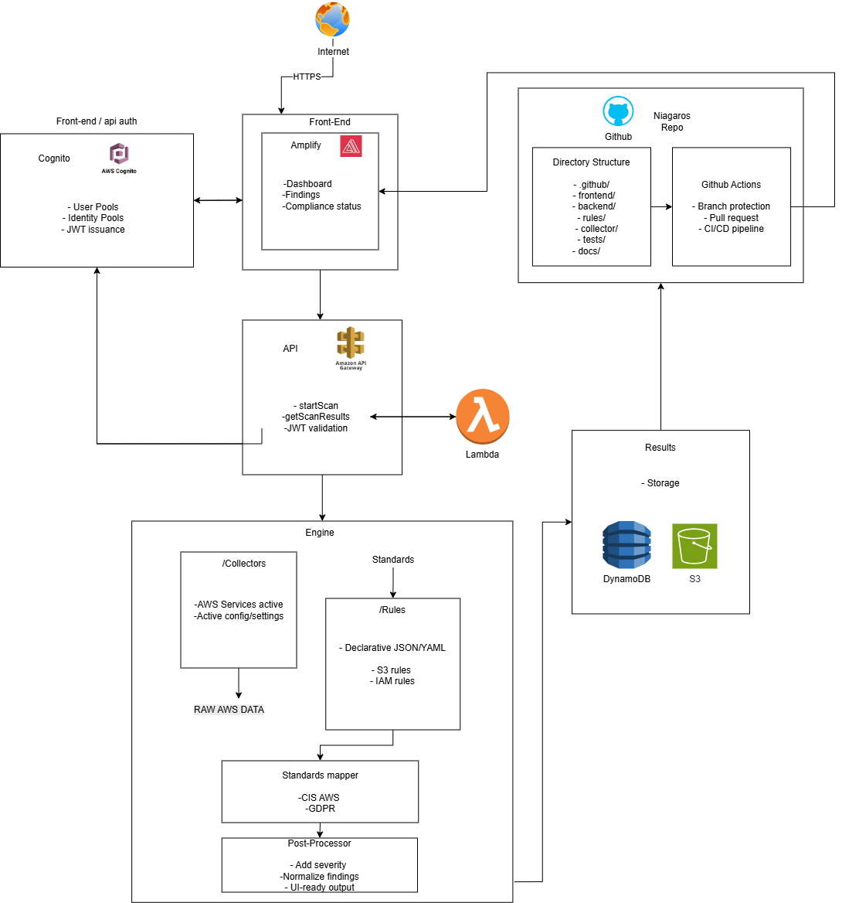

# Niagaros CNAPP (Cloud-Native Application Protection Platform)

> **Niagaros CNAPP – MVP for Domits**  
A unified cloud security platform focused on identifying, analyzing, and prioritizing misconfigurations across cloud-native environments.

---

## Social Proof
Niagaros is being actively developed and validated in collaboration with **Domits** as the first pilot customer. This MVP represents a real-world, production-focused implementation of Cloud Security Posture Management (CSPM) aligned with industry best practices and compliance frameworks.

---

## Introduction to Cloud Security

Build a shared baseline on cloud and AI-native security concepts, roles, and controls by exploring:

- **[Cloud Security Glossary](https://niagaros.com/glossary/)**  
- **[Cloud Security Skills Training (AWS, Azure, GCP, OCI)](https://niagaros.com/cloud-security-skills-training-aws-azure-gcp-oci/)**  
- **[Compliance Frameworks](https://niagaros.com/frameworks/)**  
- **[Cybersecurity Job Roles](https://niagaros.com/cybersecurity-job-roles/)**  
- **[Unified Cloud Security Categories](https://niagaros.com/unified-cloud-security-categories/)**  
- **[Cloud Security Risk Assessment](https://niagaros.com/cloud-security-risk-assessment/)**  

---

## What is Niagaros?

**Niagaros** is developing a **CNAPP (Cloud-Native Application Protection Platform)** designed to provide organizations with a **unified security architecture** that protects cloud-native applications across their entire lifecycle — from development and deployment to runtime.

CNAPP addresses the fragmentation of traditional cloud security tools by consolidating multiple security domains into a **single, integrated platform**.

### CNAPP Coverage Areas

- **CSPM** – Cloud Security Posture Management  
- **CWPP** – Cloud Workload Protection Platform  
- **CIEM** – Cloud Infrastructure Entitlements Management  
- **UVM** – Unified Vulnerability Management  
- **CDR** – Cloud Detection & Response  
- **DSPM** – Data Security Posture Management  
- **Container & Kubernetes Security**  
- **Cloud Compliance & Governance**  
- **AI-SPM** – AI Security Posture Management  
- **SCA & SBOM** – Software Supply Chain Security  
- **Sensor / Runtime Security**

> **Current Focus:** The MVP focuses exclusively on **CSPM for AWS**, starting with  resource types Domits use like: **Amazon S3, IAM, Cloudwatch**.

---

## Table of Contents

- [Introduction to Cloud Security](#introduction-to-cloud-security)  
- [Project Overview](#project-overview)  
- [MVP Scope](#mvp-scope)  
- [Architecture](#architecture)  
- [Why S3 First?](#why-s3-first)  
- [Tech Stack](#tech-stack)  
- [Development Status](#development-status)  
- [Documentation Hubs](#documentation-hubs)  
- [Repository Structure](#repository-structure)  
- [Technical Leadership](#technical-leadership)  
- [License](#-license)

---

## Project Overview

Modern cloud environments introduce a wide range of security risks, especially when configurations are inconsistent or not continuously monitored. **Domits currently lacks clear visibility into whether their AWS resources — particularly S3 buckets — are securely configured.**

Niagaros provides a targeted CSPM solution that:

- Collects AWS configuration data  
- Detects misconfigurations and security risks  
- Maps findings to industry standards and compliance frameworks  
- Rates risks by severity  
- Produces clear, actionable security insights  

This MVP lays the foundation for:

- Multi-service AWS coverage  
- Multi-cloud support (Azure, GCP)  
- Dashboards and compliance scoring  
- Automated remediation  
- Continuous monitoring and alerting  

---

## MVP Scope

### Included

- **Cloud Provider:** AWS only  
- **Service Coverage:** Amazon S3  
- **Detection Capabilities:**  
  - Public bucket exposure  
  - Missing or weak encryption  
  - Misconfigured bucket policies and ACLs  
  - Missing access logging  
  - Missing versioning  
- **Risk Classification:** Low, Medium, High, Critical  
- **Output:**  
  - CLI output or simple API response  
  - Normalized findings with metadata and severity  

### Excluded (Planned for Future Phases)

- Additional AWS services (EC2, RDS, IAM, Lambda, EKS, etc.)  
- Multi-cloud support (Azure, GCP)  
- Automated remediation  
- Web-based dashboard UI  
- Organization-wide posture scoring  
- Alerting and integrations (Slack, SIEM, ticketing systems)  

---

## Architecture



### High-Level Flow

1. **Frontend (Amplify Hosting)**  
   A future web-based dashboard secured with **Amazon Cognito** for authentication. Displays findings, risk levels, and compliance mapping.

2. **API Layer (API Gateway + Lambda)**  
   Exposes endpoints to:  
   - Trigger scans  
   - Retrieve findings  
   - Validate user identity via JWT tokens  

3. **CSPM Engine**  
   - **Collectors** – Pull raw AWS configuration data using the AWS SDK  
   - **Rule Engine** – Applies CIS AWS Benchmarks and Niagaros security rules  
   - **Standards Mapper** – Maps findings to compliance frameworks (CIS, GDPR, ISO 27001, etc.)  
   - **Post-Processor** – Normalizes results and assigns severity  

4. **Results Storage**  
   - **RDS postgresql** – Structured findings and metadata  
   - **Amazon S3** – Raw scan data and historical reports  

5. **CI/CD & Source Control (GitHub + Amplify)**  
   Automated pipelines for:  
   - Testing  
   - Security scanning  
   - Deployment to AWS  

---

## Why S3 First?

Amazon S3 is one of the most commonly misconfigured cloud services and a leading cause of:

- Data exposure  
- Public access leaks  
- Sensitive information disclosure  
- Compliance violations  

Starting with S3 allows Niagaros to:

- Validate the rule engine architecture  
- Establish standards mapping  
- Prove value quickly for Domits  
- Build a scalable foundation for future cloud services  

---

## Technology Stack

### Frontend
- React Native  
- TypeScript / JavaScript  
- SASS / SCSS  

### Backend
- Node.js  
- AWS Lambda  
- PostgreSQL  

### Cloud & Infrastructure
- Amazon Web Services (AWS)  
- Amplify Hosting  
- API Gateway  
- RDS Postgresql
- Amazon S3  
- Amazon Cognito  

### DevOps & Tooling
- GitHub Actions (CI/CD)  
- npm  

### Testing
- Jest  
- Cypress  

---

### Adding a new service
 
The engine auto-discovers collectors and rules at runtime. To add a new service:
 
1. Create `backend/src/collectors/aws/<service>/collector.py` — inherits `BaseCollector`, implements `collect()`
2. Create rule files under `backend/src/rules/cis/<service>/` — one file per CIS control
3. Deploy the new Lambda function
4. Insert a row in the `scanners` table
5. No changes to the engine or orchestrator needed
 
---
 
## Getting Started
 
### Prerequisites
 
- AWS CLI with SSO profile `niagaros-cspm` configured
- Python 3.9
- PowerShell (for deployment scripts)
- Access to CSPM platform account `225989360315` in `eu-west-1`
 
See `docs/onboarding.md` for full setup instructions.
 
### Login
 
```powershell
aws sso login --profile niagaros-cspm
$env:AWS_PROFILE = "niagaros-cspm"
```
 
### Deploy the orchestrator
 
```powershell
cd backend
Copy-Item -Recurse src/orchestrator package/ -Force
Copy-Item -Recurse src/config package/ -Force
cd package
Compress-Archive -Path * -DestinationPath ../cspm-orchestrator.zip -Force
cd ..
aws lambda update-function-code --function-name cspm_orchestrator --region eu-west-1 --zip-file fileb://cspm-orchestrator.zip
```
 
### Deploy the S3 scanner
 
```powershell
Copy-Item -Recurse src/api package/ -Force
Copy-Item -Recurse src/collectors package/ -Force
Copy-Item -Recurse src/config package/ -Force
Copy-Item -Recurse src/engine package/ -Force
Copy-Item -Recurse src/postprocess package/ -Force
Copy-Item -Recurse src/rules package/ -Force
Copy-Item -Recurse src/standards package/ -Force
cd package
Compress-Archive -Path * -DestinationPath ../cspm-scanner.zip -Force
cd ..
aws lambda update-function-code --function-name cis_s3_scanner --region eu-west-1 --zip-file fileb://cspm-scanner.zip
```
 
### Invoke the orchestrator
 
```powershell
'{}' | Out-File -FilePath orchestrator-payload.json -Encoding utf8
aws lambda invoke `
    --function-name cspm_orchestrator `
    --region eu-west-1 `
    --payload fileb://orchestrator-payload.json `
    orchestrator-response.json ; Get-Content orchestrator-response.json
```
 
### Run tests
 
```bash
cd backend
npm test
```
 
---
 
## Contributing Guidelines
 
1. Branch from `main`:
```bash
git checkout -b feature/<short-description>
```
 
2. Keep PRs small and focused — one feature or fix per PR
3. Follow existing patterns — use `BaseCollector` and `BaseCheck` for all new collectors and rules
4. Add unit tests for any new collector or rule
5. Open a PR against `main` — describe what changed and link related issues
 
Security-sensitive contributions (new rules, IAM changes, compliance mappings) are reviewed more strictly before merge.

---

## Documentation Hubs

Niagaros documentation is structured to serve multiple audiences:

- **`docs/internal`**  
  Internal Niagaros documentation, including:  
  - Product vision  
  - Long-term roadmap  
  - Architecture decisions  
  - Security models  

- **`docs/public`**  
  Public-facing documentation:  
  - Security rules  
  - CSPM methodology  
  - Detected misconfiguration types  
  - Compliance mappings  

- **`docs/partner`**  
  Partner documentation (e.g., Domits):  
  - Onboarding guides  
  - Integration steps  
  - Usage instructions  
  - Access and permissions setup  

---

## Repository Structure

### `/.github`
GitHub configuration for workflows, security scanning, and templates.  
Used to automate CI/CD and enforce consistent quality and security checks.

### `/frontend`
Frontend application responsible for:
- Displaying scan results  
- Visualizing risk levels  
- Showing compliance mappings  


> The frontend never talks directly to AWS APIs. All security logic remains server-side.

### `/backend`
Serverless backend running on **AWS Lambda + API Gateway**.

Responsibilities:
- Collect AWS configuration data  
- Apply security rules  
- Map to compliance standards  
- Normalize and score risks  

Structure:
- `src/api` – API handlers  
- `src/engine` – Scan and rule engine  
- `src/collectors` – AWS data collectors  
- `src/rules` – Declarative security rules  
- `src/standards` – Compliance mappings  
- `src/postprocess` – Normalization and scoring  
- `src/utils` – Shared utilities  
- `src/tests` – Unit and integration tests  
- `src/config` – Runtime configuration  
- `serverless.yml` – Infrastructure as code  

### `/shared`
Shared types, enums, and constants used by both frontend and backend.  
Ensures consistent schemas for findings, severities, and labels.

### `/docs`
Architecture documentation, research, rule design, and onboarding material.  
Used for internal alignment and external partner enablement.

---

## Technical Leadership

This project follows:
- **Security-first design principles**  
- **Infrastructure as Code (IaC)**  
- **Least-privilege IAM model**  
- **Compliance-driven architecture**  
- **Scalable, event-driven design**  

---

## 📄 License

This project is licensed under the **MIT License**.

You are free to:
- Use the code for personal or commercial purposes  
- Modify and distribute the code  
- Include it in proprietary or open-source projects  

Under the following conditions:
- The original copyright and license notice must be included in all copies or substantial portions of the software  
- All contributions are assumed to be licensed under the same MIT License unless explicitly stated otherwise  

This software is provided **“as is”**, without warranty of any kind.

See the [LICENSE](./LICENSE) file for full details.
