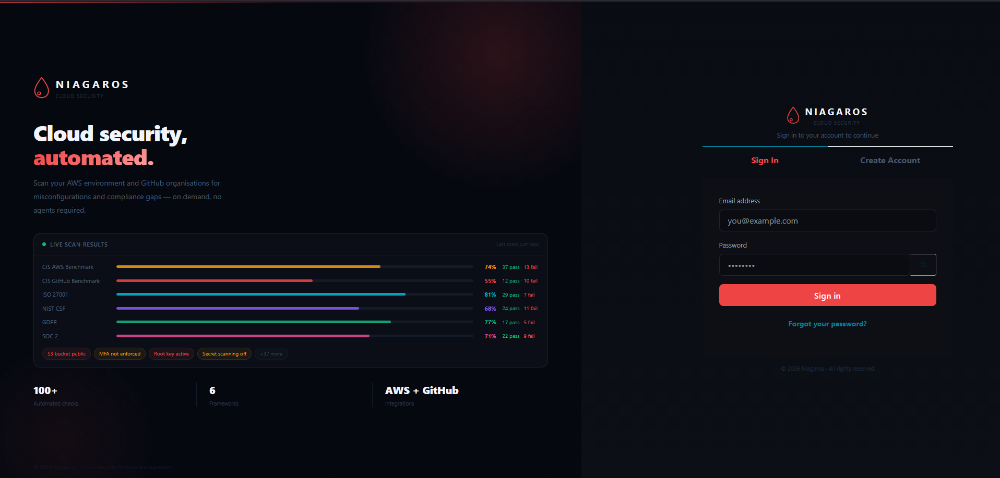
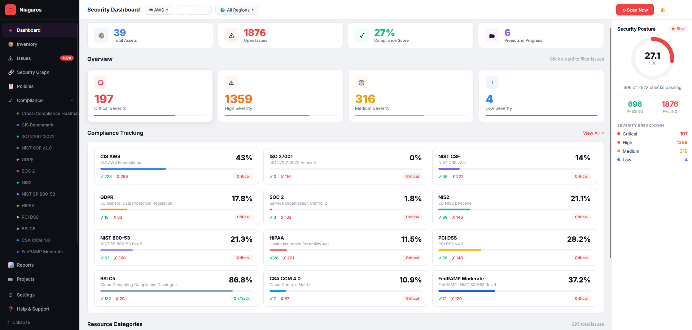
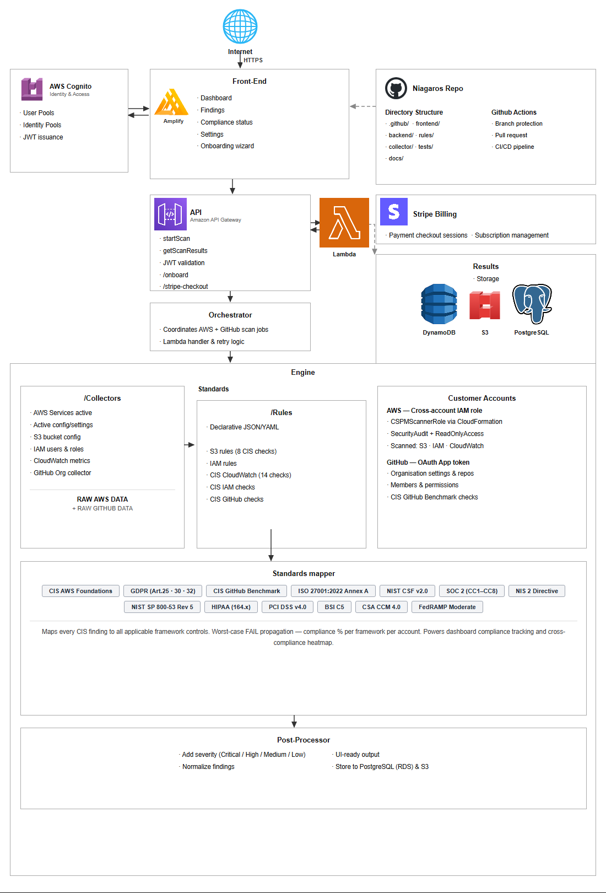

# Niagaros CNAPP

### Cloud-Native Application Protection Platform

**Scan your AWS environment and GitHub organisations for misconfigurations and compliance gaps — on demand, no agents required.**

---

### Platform

*Sign in to your account to start scanning*

### Security Dashboard

*Live compliance tracking across 13 frameworks — Critical · High · Medium · Low severity breakdown*

---

## Social Proof

Niagaros is being actively developed and validated in collaboration with **Domits** as the first pilot customer. This MVP represents a real-world, production-focused implementation of Cloud Security Posture Management (CSPM) aligned with industry best practices and compliance frameworks.

---

## Introduction to Cloud Security

Build a shared baseline on cloud and AI-native security concepts, roles, and controls by exploring:

- **[Cloud Security Glossary](https://niagaros.com/glossary/)**
- **[Cloud Security Skills Training (AWS, Azure, GCP, OCI)](https://niagaros.com/cloud-security-skills-training-aws-azure-gcp-oci/)**
- **[Compliance Frameworks](https://niagaros.com/frameworks/)**
- **[Cybersecurity Job Roles](https://niagaros.com/cybersecurity-job-roles/)**
- **[Unified Cloud Security Categories](https://niagaros.com/unified-cloud-security-categories/)**
- **[Cloud Security Risk Assessment](https://niagaros.com/cloud-security-risk-assessment/)**

---

## What is Niagaros?

**Niagaros** is developing a **CNAPP (Cloud-Native Application Protection Platform)** that protects cloud-native applications across their entire lifecycle — from development and deployment to runtime.

> **Current Focus:** CSPM for AWS (S3, IAM, CloudWatch) and GitHub organisation security, with a web-based dashboard and compliance reporting across **13 frameworks**.

### CNAPP Coverage Areas

| Domain | Description |
|---|---|
| **CSPM** | Cloud Security Posture Management |
| **CWPP** | Cloud Workload Protection Platform |
| **CIEM** | Cloud Infrastructure Entitlements Management |
| **UVM** | Unified Vulnerability Management |
| **CDR** | Cloud Detection & Response |
| **DSPM** | Data Security Posture Management |
| **Container & Kubernetes Security** | Runtime container protection |
| **Cloud Compliance & Governance** | Policy enforcement & audit |
| **AI-SPM** | AI Security Posture Management |
| **SCA & SBOM** | Software Supply Chain Security |
| **Sensor / Runtime Security** | Agent-based runtime protection |

---

## Table of Contents

- [Social Proof](#social-proof)
- [Introduction to Cloud Security](#introduction-to-cloud-security)
- [Project Overview](#project-overview)
- [Architecture](#architecture)
- [MVP Scope](#mvp-scope)
- [Tech Stack](#tech-stack)
- [Development Status](#development-status)
- [Pricing Plans](#pricing-plans)
- [Documentation Hubs](#documentation-hubs)
- [Repository Structure](#repository-structure)
- [Technical Leadership](#technical-leadership)
- [License](#-license)

---

## Project Overview

Modern cloud environments introduce a wide range of security risks, especially when configurations are inconsistent or not continuously monitored. Organizations often lack clear visibility into whether their AWS resources and GitHub organisations are securely configured.

Niagaros provides a targeted CSPM solution that:

- Collects AWS and GitHub configuration data
- Detects misconfigurations and security risks
- Maps findings to 13 industry compliance frameworks
- Rates risks by severity (Critical / High / Medium / Low)
- Delivers actionable insights via a web-based dashboard

This MVP lays the foundation for:

- Full multi-service AWS coverage
- Multi-cloud support (Azure, GCP, OCI)
- Automated remediation
- Continuous monitoring and alerting
- Organisation-wide posture scoring

---

## Architecture

| Layer | Components |
|---|---|
| **Frontend** | React + Vite on AWS Amplify, secured with Amazon Cognito |
| **API** | API Gateway + Lambda — startScan, getScanResults, /onboard, /stripe-checkout |
| **Collectors** | AWS (S3 · IAM · CloudWatch) + GitHub Org — reads via cross-account IAM role |
| **Engine** | Rule Engine → Standards Mapper (13 frameworks) → Post-Processor |
| **Storage** | DynamoDB · S3 · PostgreSQL |
| **Customer Accounts** | CSPMScannerRole via CloudFormation (SecurityAudit + ReadOnlyAccess) · GitHub OAuth |
| **CI/CD** | GitHub Actions + Amplify |

---

## MVP Scope

### Included

- **Cloud Providers:** AWS, GitHub organisations
- **AWS Service Coverage:** Amazon S3, IAM, CloudWatch
- **GitHub Coverage:** Organisation-level CIS checks
- **Detection Capabilities:**
  - S3: Public exposure, encryption, ACLs, logging, versioning (CIS 2.1–3.4)
  - IAM: Credential report analysis, policy normalization, user checks
  - CloudWatch: 14 CIS CloudWatch metric filter and alarm checks
  - GitHub: CIS GitHub Benchmark checks
- **Risk Classification:** Low · Medium · High · Critical
- **Authentication:** Amazon Cognito (email/password)
- **Billing:** Stripe — Essentials plan

### Compliance Frameworks (13)

| Framework | Full Name |
|---|---|
| CIS AWS | CIS AWS Foundations Benchmark |
| ISO 27001:2022 | ISO 27001:2022 Annex A |
| NIST CSF v2.0 | NIST Cybersecurity Framework v2.0 |
| GDPR | EU General Data Protection Regulation |
| SOC 2 | Service Organization Control 2 |
| NIS 2 | EU NIS2 Directive |
| NIST SP 800-53 | NIST SP 800-53 Rev 5 |
| HIPAA | Health Insurance Portability Act |
| PCI DSS | PCI DSS v4.0 |
| BSI C5 | Cloud Computing Compliance Catalogue |
| CSA CCM 4.0 | Cloud Controls Matrix |
| FedRAMP Moderate | FedRAMP – NIST 800-53 Rev 4 |
| CIS GitHub Benchmark | CIS GitHub Benchmark |

### Excluded (Future Phases)

- Additional AWS services (EC2, RDS, Lambda, EKS)
- Full multi-cloud (Azure, GCP) — scaffold ready
- Automated remediation
- Alerting integrations (Slack, SIEM)

---

## Tech Stack

### Frontend
- React · TypeScript · Vite · AWS Amplify UI

### Backend
- Python (Lambda) · Node.js · AWS Lambda · PostgreSQL

### Cloud & Infrastructure
- AWS · Amplify Hosting · API Gateway · Amazon Cognito · S3 · CloudFormation

### Payments
- Stripe (Checkout, Price IDs, webhook-ready)

### DevOps & Tooling
- GitHub Actions · npm / pip · Jest · Cypress

---

## Development Status

Niagaros is in active development.

- [x] S3 collector + 8 CIS rules
- [x] IAM collector + CIS checks
- [x] CloudWatch collector + 14 CIS rules
- [x] GitHub organisation collector + CIS checks
- [x] Core rule engine + risk scoring
- [x] Standards mapper (13 frameworks)
- [x] Web dashboard (v1 + v2)
- [x] Onboarding wizard (4-step AWS IAM role setup)
- [x] Amazon Cognito authentication
- [x] Settings pages (Company, GitHub, Personal, Plans)
- [x] Stripe billing integration
- [ ] Additional AWS services (EC2, RDS, Lambda, EKS)
- [ ] Azure / GCP full implementation
- [ ] Automated remediation
- [ ] Alerting integrations (Slack, SIEM)
- [ ] Production validation with pilot customer

---

## Pricing Plans

| Plan | Monthly | Yearly | Users |
|---|---|---|---|
| **Developer** | Free | Free | 1 |
| **Essentials** | €499 | €5,000 (~15% off) | 10 |
| **Mid-Market** | €2,499 | €25,000 | 10 |
| **Enterprise** | €20,000 | €200,000 | 10+ |

- **Developer** – Full CSPM, single-cloud, all 13 frameworks, self-service
- **Essentials** – + 1:1 onboarding, Stripe checkout
- **Mid-Market** – + premium support + add-ons
- **Enterprise** – Multi-cloud, full CNAPP capabilities
---

## Documentation Hubs

- **`docs/internal`** — Product vision, roadmap, architecture decisions, security models
- **`docs/public`** — Security rules, CSPM methodology, compliance mappings
- **`docs/partner`** — Partner onboarding guides, integration steps, permissions setup

---

## Repository Structure

### `/.github`
Workflows, security scanning, templates.

### `/frontend`
React + Vite web application.
- `src/App.tsx` – App shell, Cognito Authenticator, onboarding wizard
- `src/settings/` – Company, GitHub, PersonalData, Plans (Stripe)
- `src/pages/` – Main application pages

> The frontend never talks directly to AWS APIs. All security logic remains server-side.

### `/backend`
Python + Node.js serverless backend on AWS Lambda + API Gateway.
- `src/collectors/aws/` – S3, IAM, CloudWatch, KMS, AccessAnalyzer, SecurityHub
- `src/collectors/github/` – GitHub organisation collector
- `src/collectors/azure/` · `google/` · `oracle/` – scaffold (future)
- `src/rules/` – CIS S3 (8), IAM, CloudWatch (14)
- `src/standards/` – 13 compliance framework mappers
- `src/orchestrator/` · `src/postprocess/` · `src/engine/`

### `/shared`
Shared types, enums, constants.

### `/docs`
Architecture, research, rule design, onboarding material.

### `/stripe_layer` / `/stripe_package`
AWS Lambda layer — Stripe SDK for billing.

---

## Technical Leadership

- Security-first design principles
- Infrastructure as Code (IaC)
- Least-privilege IAM model
- Compliance-driven architecture
- Scalable, event-driven design

---

## 📄 License

MIT License — free to use, modify, and distribute with original copyright notice included.

See the [LICENSE](./LICENSE) file for full details.
